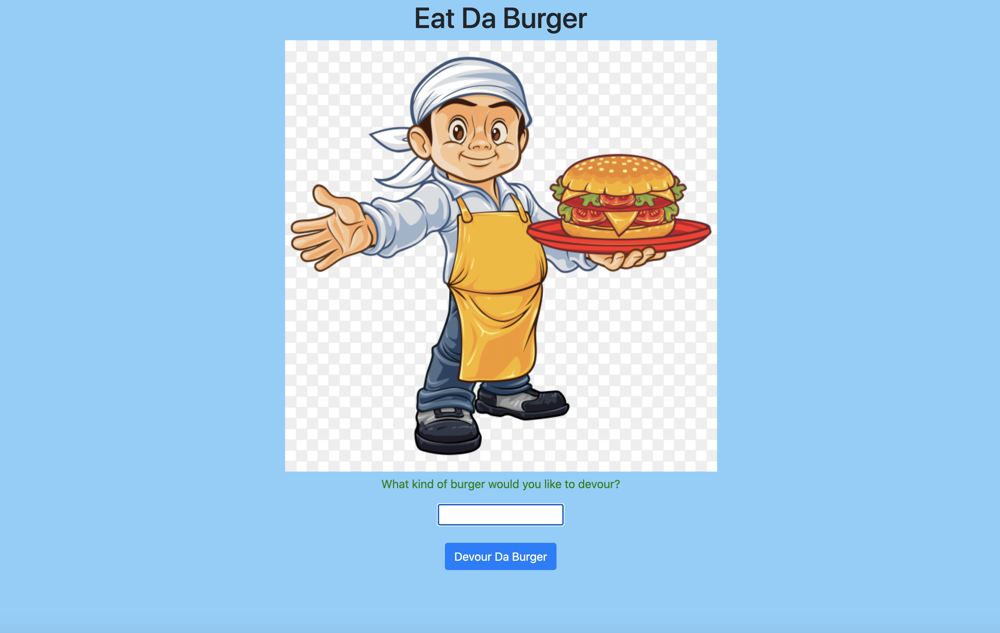

# eat da burger

# Table of Contents

* [Process](#Process)
* [Issues](#Issues)
* [Video](#Video)
* [Link](#Link)
* [Screenshot](#Screenshot)

## Description
* This is a web application to track the types of burgers a user has eaten. It was built on the client side using express handlebars and it is linked to a MySQL database. 

## Issues
* Issues with local host
* Issues deploying to heroku
* Bit of trouble connecting my database but it got figured out! 

## Future-Plans

## Link 

[Eat Da Burger](https://mvceatdaburger.herokuapp.com/burgers)

## Screenshot

